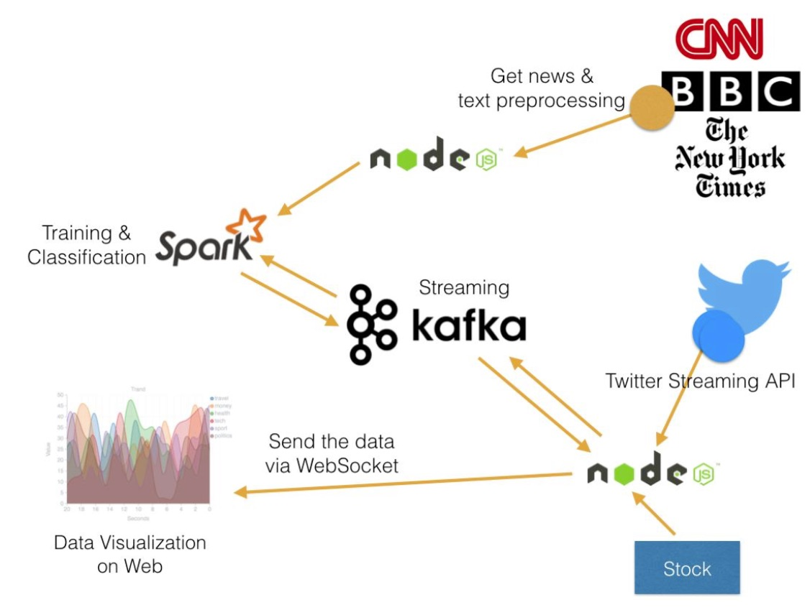
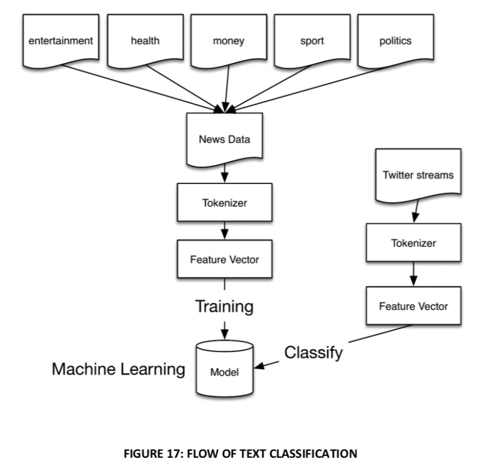
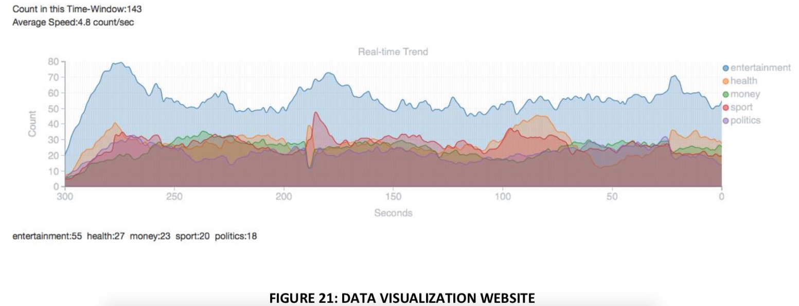

# Streaming-Pipeline
A real-time classification based on Kafka and Spark.

This project is part of my paper. This project only contain the Training Classification pipeline.



1: We collected the recent news data from CNN, BBC and The New York Times. Currently, I only use six categories. These news data will need process first, like remove stopwords and other unneeded words.

This project is not include in this repository.

Before
```
The gist of the plot involves Hank realizing that Scott's daring 
leap into the quantum realm in the first movie might hold the key to finding 
and freeing his long-lost wife, Janet (Michelle Pfeiffer), 
who disappeared into it decades earlier. Their efforts, however, attract the att.....
```
After
```
gist plot involves hank realizing scott daring leap quantum 
realm movie hold key finding freeing long lost wife janet 
michelle pfeiffer disappeared decades earlier efforts attract attention my.......
```




2: Next, The Spark MLLib

We can use the different algorithm and feature extraction.
regex,hashingTF,naiveBayes.

```
def train(trainingSet:DataFrame,testSet:DataFrame) : CrossValidatorModel = {
    var regex = new RegexTokenizer().setInputCol("sentence").setOutputCol("filtered").setPattern("\\w+").setGaps(false)
    var hashingTF = new HashingTF().setInputCol("filtered").setOutputCol("features").setNumFeatures(numberOfFeature)
    var idf = new IDF().setInputCol("rawFeatures").setOutputCol("features")
    val countVector = new CountVectorizer().setInputCol("filtered").setOutputCol("features").setVocabSize(100)

    var forest = new RandomForestClassifier()
      .setLabelCol("label")
      .setFeaturesCol("features")
      .setFeatureSubsetStrategy("auto")

    val desTree = new DecisionTreeClassifier()
    val naiveBayes = new NaiveBayes().setModelType("multinomial")

    val transformers = Array(
      //new StringIndexer().setInputCol("group").setOutputCol("label"),
      //new Tokenizer().setInputCol("sentence").setOutputCol("tokens"),
      //new StopWordsRemover().setStopWords(getStopWords).setCaseSensitive(false).setInputCol("tokens").setOutputCol("filtered"),
      regex,hashingTF,naiveBayes
    )

      val pipeLine = new Pipeline().setStages(transformers)

// We use a ParamGridBuilder to construct a grid of parameters to search over.
// With 3 values for hashingTF.numFeatures and 2 values for lr.regParam,
// this grid will have 3 x 2 = 6 parameter settings for CrossValidator to choose from.
    val paramGrid = new ParamGridBuilder()
      .addGrid(hashingTF.numFeatures, Array(5000, 10000, 15000, 20000, 25000, 30000))
      .build()

    // We now treat the Pipeline as an Estimator, wrapping it in a CrossValidator instance.
    // This will allow us to jointly choose parameters for all Pipeline stages.
    // A CrossValidator requires an Estimator, a set of Estimator ParamMaps, and an Evaluator.
    // Note that the evaluator here is a BinaryClassificationEvaluator and its default metric
    // is areaUnderROC.
    val cv = new CrossValidator()
      .setEstimator(pipeLine)
      .setEvaluator(new MulticlassClassificationEvaluator())
      .setEstimatorParamMaps(paramGrid)
      .setNumFolds(5)  // Use 3+ in practice

    // Run cross-validation, and choose the best set of parameters.
    val model = cv.fit(trainingSet)

    val bestModel = model.bestModel.asInstanceOf[PipelineModel]
    val stages = bestModel.stages

    val hashingStage = stages(1).asInstanceOf[HashingTF]
    println("numFeatures = " + hashingStage.getNumFeatures)


    val prediction = model.transform(testSet)
    evaluationMetrics(prediction)

    //    val da = prediction.select("label","prediction","filtered")
    //    da.write.format("json").mode("OverWrite").save("prediction")

        return model
  }
```


## The UI monitor for Twitter trend.

This project is not include in this repository.

